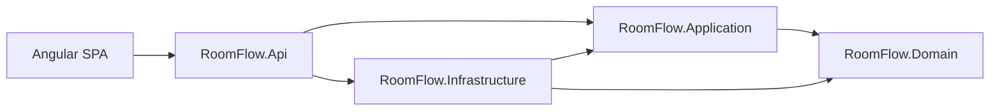

# Room Flow

Application to book and manage meeting rooms: week calendar, JWT auth, and Admin vs User roles.

The UI is in French. The API is ASP.NET Core (.NET 10) with Clean Architecture; the client is Angular 22.

## Demo

Live app: https://lively-flower-0424a3b0f.7.azurestaticapps.net/

Sign up creates a **User** account. Promote someone to **Admin** in the database:

```sql
UPDATE Users SET Role = 'Admin' WHERE Email = 'you@example.com';
```

Then sign out and sign in again so the new role is in the JWT.

## Features

- Register and login with JWT (access token + refresh token)
- Personal agenda (week calendar) and per-room availability
- Create and cancel bookings (overlap checks, 15-minute slots, 08:00–20:00)
- Room list; only **Admin** can add or delete rooms

## Stack

- **Frontend:** Angular 22, Angular Material, signals
- **Backend:** ASP.NET Core (.NET 10), EF Core, MediatR (CQRS), JWT
- **Cloud:** Azure SQL, Container Apps, Static Web Apps, GitHub Actions

## Architecture

Clean Architecture: `Api` talks to `Application`; `Infrastructure` implements persistence and JWT; `Domain` has no outward dependencies.



## Local development

Prerequisites: .NET 10 SDK, Node.js 22, SQL Server LocalDB.

1. Copy [`backend/RoomFlow.Api/appsettings.example.json`](backend/RoomFlow.Api/appsettings.example.json) to `backend/RoomFlow.Api/appsettings.json` and set the connection string and JWT signing key (at least 32 bytes).
2. Apply migrations:

```bash
dotnet ef database update --project backend/RoomFlow.Infrastructure --startup-project backend/RoomFlow.Api
```

3. Start the API:

```bash
dotnet run --project backend/RoomFlow.Api
```

The API listens on http://localhost:5205 (Swagger: http://localhost:5205/swagger).

4. Start the frontend:

```bash
cd frontend
npm start
```

The UI is at http://localhost:4200. The Angular proxy forwards `/api` to the API.

## Docker (local)

Prerequisites: Docker Desktop (Linux containers).

1. Copy the environment template and adjust if needed (the SQL Server password must include uppercase, lowercase, a digit, and a symbol):

```bash
cp .env.example .env
```

2. Build and start the frontend, API, and SQL Server:

```bash
docker compose up --build
```

The app is available at http://localhost:8080. nginx serves the Angular SPA and proxies `/api` and `/swagger` to the API. Swagger: http://localhost:8080/swagger. SQL Server stays on the Docker network (not published on the host, so it does not clash with LocalDB).

Stop:

```bash
docker compose down
```

SQL Server data is kept in the `sqlserver_data` volume. To reset everything: `docker compose down -v`.

## CI/CD (GitHub Actions → Azure)

Pull requests run [`.github/workflows/ci.yml`](.github/workflows/ci.yml) (`dotnet test` + `ng test`). Pushes to `main` run [`.github/workflows/deploy.yml`](.github/workflows/deploy.yml): Bicep (Azure SQL, ACR, Container Apps, Static Web Apps Free), API image, then the Angular app.

The browser calls the Container Apps API by HTTPS (CORS). Local and Docker still use relative `/api` URLs.

### One-time Azure / GitHub setup

1. Create an Azure AD app registration (or user-assigned identity) and a **federated credential** for this repo (`repo:OWNER/room-flow:ref:refs/heads/main`).
2. Grant that identity **Contributor** and **User Access Administrator** on the subscription or on resource group `rg-roomflow` (role assignments are required so the Container App identity can pull from ACR).
3. Add GitHub Actions secrets:

| Secret | Purpose |
|--------|---------|
| `AZURE_CLIENT_ID` | App registration (or managed identity) client ID |
| `AZURE_TENANT_ID` | Azure AD tenant |
| `AZURE_SUBSCRIPTION_ID` | Subscription that hosts `rg-roomflow` |
| `SQL_ADMIN_PASSWORD` | Azure SQL admin password (uppercase, lowercase, digit, symbol) |
| `JWT_SIGNING_KEY` | JWT key, at least 32 bytes |
| `AZURE_STATIC_WEB_APPS_API_TOKEN` | Optional. If omitted, the workflow reads the token from the Static Web App after Bicep create |

4. Push to `main` (or run **Deploy Azure** via workflow_dispatch).

After a successful deploy, the workflow logs / Azure portal show:

- Static Web App URL: `https://<name>.azurestaticapps.net`
- API health: `https://<container-app-fqdn>/health`

Swagger is disabled on Azure (`ENABLE_SWAGGER=false`). Use it locally: http://localhost:5205/swagger or http://localhost:8080/swagger.
